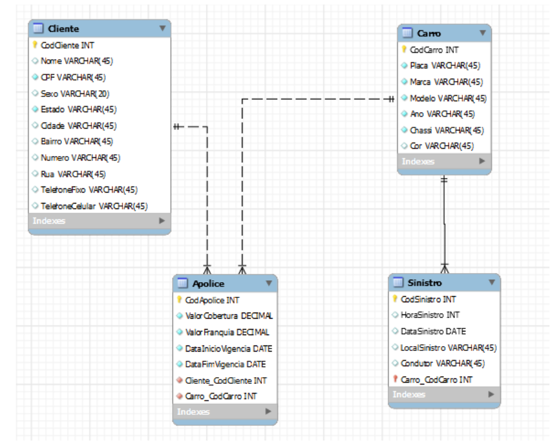

# Atividade 1: SQL Server

O código apresentado é um conjunto de comandos DDL (Data Definition Language) em SQL Server para a criação de quatro tabelas em um banco de dados. As tabelas são: Cliente, Apolice, Carro e Sinistro. Atividade realizada para FATEC Itapira, matéria de Banco de Dados, professor: Mateus Guilherme Fuini.



## Cliente

A tabela Cliente contém informações sobre os clientes da seguradora. Ela possui uma chave primária CodCliente, que identifica de forma única cada cliente. Além disso, a tabela possui outras colunas, como Nome, CPF, Sexo, Estado, Cidade, Bairro, Numero, Rua, TelefoneFixo e TelefoneCelular, que armazenam informações pessoais e de contato dos clientes. Algumas colunas possuem restrições, como a coluna Nome que não pode ser nula (NOT NULL), e as colunas CPF e TelefoneCelular que devem ser únicas (UNIQUE). A coluna Cidade possui um valor padrão definido como 'Itapira', ou seja, caso a informação não seja fornecida, esse será o valor padrão atribuído.

```sql
-- Cliente:
CodCliente INT
Nome Varchar(45)
CPF Varchar(45)
Sexo Varchar(20)
Estado Varchar(45)
Cidade Varchar(45)
Bairro Varchar(45)
Numero Varchar(45)
Rua Varchar(45)
TelefoneFixo Varchar(45)
TelefoneCelular Varchar(45)
```

## Apolice

A tabela Apolice armazena informações sobre as apólices de seguro dos clientes. Cada apólice é identificada por um número único CodApolice. Além disso, a tabela possui outras colunas, como ValorCobertura, ValorFranquia, DataInicioVigencia, DataFimVigencia, Cliente_CodCliente e Carro_CodCarro, que armazenam informações sobre a cobertura do seguro, vigência da apólice, e quais carros e clientes estão associados a cada apólice. As colunas Cliente_CodCliente e Carro_CodCarro são chaves estrangeiras que se relacionam com a tabela Cliente e Carro, respectivamente.

```sql
-- Apolice
CodApolice INT
ValorCobertura DECIMAL
ValorFranquia DECIMAL
DataInicioVigencia DATE
DataFimVigencia DATE
Cliente_CodCliente INT
Carro_CodCarro INT
```

## Carro

A tabela Carro contém informações sobre os carros dos clientes da seguradora. Cada carro é identificado por um número único CodCarro. Além disso, a tabela possui outras colunas, como Placa, Marca, Modelo, Ano, Chassi e Cor, que armazenam informações sobre o carro de cada cliente.

```sql
-- Carro
CodCarro INT
Placa VARCHAR(45)
Marca VARCHAR(45)
Modelo VARCHAR(45)
Ano VARCHAR(45)
Chassi VARCHAR(45)
Cor VARCHAR(45)
```


## Sinistro

Por fim, a tabela Sinistro armazena informações sobre os sinistros envolvendo os carros dos clientes. Cada sinistro é identificado por um número único CodSinistro. Além disso, a tabela possui outras colunas, como HoraSinistro, DataSinistro, LocalSinistro, Condutor e Carro_CodCarro, que armazenam informações sobre o horário, data, local, condutor e qual carro está envolvido em cada sinistro. A coluna Carro_CodCarro é uma chave estrangeira que se relaciona com a tabela Carro.

```sql
-- Sinistro
CodSinistro INT
HoraSinistro Int
DataSinistro DATE
LocalSinistro VARCHAR(45)
Condutor VARCHAR(45)
Carro_CodCarro INT
```

### Considerações extras

```sql
Tabela Clientes:
    Chave Primária: CodCliente

    Colunas obrigatórias: Nome, CPF, TelefoneCelular

    Colunas Únicas: CPF, TelefoneCelular

    Coluna com valor padrão: Cidade – Valor Padrão ‘Itapira’

Tabela Apólice:
    Chave Primária: CodApolice

    Chave Estrangeira:
        Cliente_CodCliente
        Carro_CodCarro

    Colunas Obrigatória: Todas

    Coluna com checagem:
        DataInicioVigencia: Maior que a data atual
Tabela Carro:
    Chave Primária: CodCarro

Tabela Sinistro:
    Chave Primária Composta:
        CodSinistro
        Carro_CodCarro

    Chave Estrangeira:
        Carro_CodCarro
```
